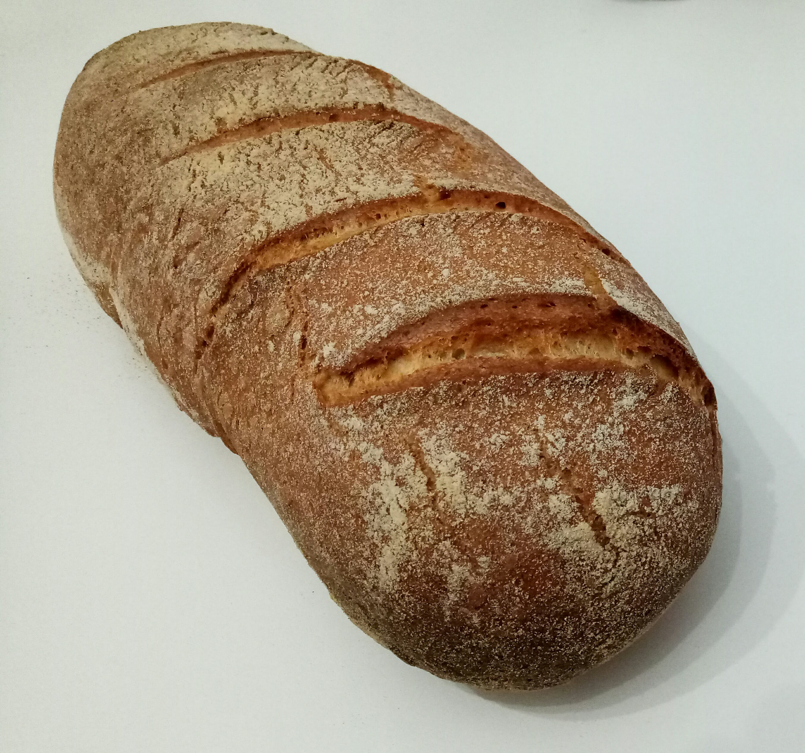

# Pâte à pain universelle

## Ingrédients
    490g de farine (440g de T65 et 50g de T110)
    30cl d'eau tiède
    7g de sel
    3g de sucre
    5g de levure sèche (ou 20g de levure fraiche)

## Recette
Cette recette sert de base à tout type de pain : boule, boulot, aux graines, ...

Mélanger l'eau tiède (30 secondes au micro onde), la levure et le sucre. La chaleur et le sucre vont activer la levure. Laisser la levure agir pendant un quart d'heure. Ajouter la farine puis le sel (ne jamais mettre le sel et la levure en contact direct, ça casserait la fermentation). Dans le cas d'un pain aux graines (courge, lin, tournesol, sarrasin, ...), c'est le moment de les ajouter au bol. Pétrir à la machine pendant 4 minutes ou à la main pendant 10 à 12 minutes. Il est important de terminer le pétrissage à la main pour sentir la pâte changer de consistence. Une fois le glutten cassé, elle devient plus tendre et élastique. Bouler, poser la pâte dans un saladier, couvrir et faire une levée de deux heures à température ambiante ou une heure au four (en étuve ou à 30~40°C).  

Faire préchauffer le four à 240°C avec un lèche frite.

Fariner légèrement le plan de travail. Retirer délicatement la pâte du saladier à l'aide d'une corne de pâtissier. Prendre garde à ne pas déchirer la pâte, à ce stade elle est très fragile. La pesanteur devrait suffire à dégazer légèrement le pâton. Faire quatre rabats délicatement en tentant d'emprisonner un maximum d'air. Bouler la pâte sans l'écraser pour un pain boule, l'allonger pour un boulot. Laisser lever pendant 15 minutes. Prendre le surplus de farine du plan de travail et le saupoudrer sur le pain après l'avoir enfermé entre les deux paumes de main. Juste avant d'enfourner, grigner le pain avec un cutter de boulanger (une lame de rasoir ou un couteau très aiguisé). Faire une buée en lancant le contenu d'un verre d'eau dans le lèche frite (refermer la porte du four tout de suite après).

Au bout de 30 minutes de cuisson, sortir le pain du four, le poser sur une grille, approcher son oreille et profiter du son du travail bien fait quand la croûte commence à craquer. 
