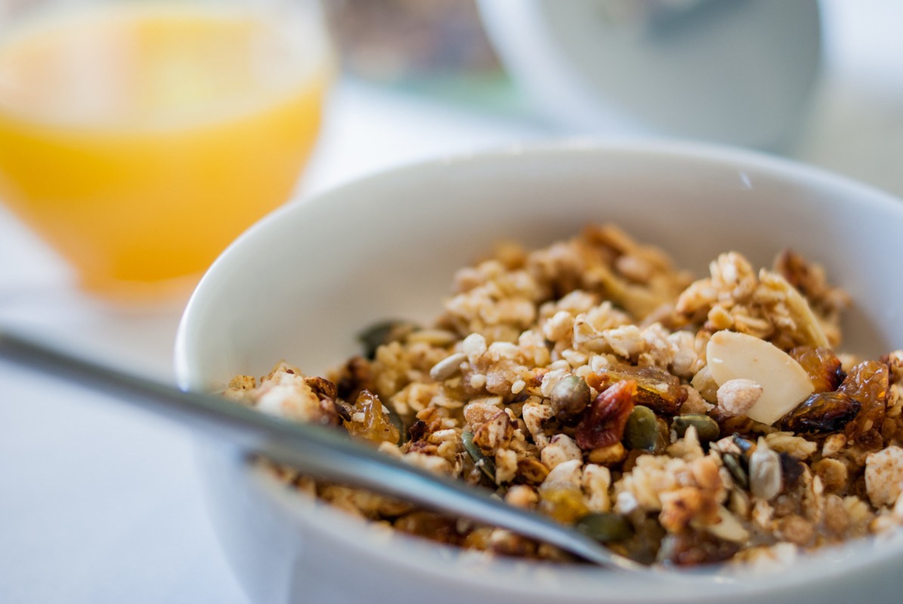

# Muesli sarrasin, chocolat et coco
(sans glutten, sans lactose et sans oeuf)  

## Ingrédients
    140g de miel (le goût du miel ayant tendance à ressortir dans le muesli, préférez un miel d'acacia pour plus de douceur. Pour ma part je préfère les miels plus intenses comme le miel de thym ou de châtaignier)
    80g de votre beurre végétal habituel
    140g de flocons de sarrasin
    50g de sarrasin soufflé
    100g de riz soufflé au chocolat
    70g d'amandes effilées
    50g de noix de coco râpée
    30g de graines de courge
    30g de graines de tournesol

## Recette
Il faut bien l'avouer, quand on est intolérant au gluten et au lactose, le petit déjeuner devient vite un casse-tête. Pas de panique car avec un peu d'organisation et d'imagination, il n'y a que des solutions. Accompagné d'un fruit, pour un petit déjeuner équilibré, et de lait végétal (amande, coco, soja…) ce muesli est un vrai délice.

Allumez votre fur à 18O°. Dans une grande casserole, faire fondre le beurre végétal et le miel. Ajoutez ensuite les flocons de sarrasin, le sarrasin soufflé, le riz soufflé au chocolat, les amandes effilées ; la coco râpée et les graines. Mélangez le tout. Étalez, en tassant légèrement, dans une plaque allant au four. (La lèche frite de votre four peut faire l'affaire). Enfournez pour 5 minutes. Surveillez la cuisson il faut que vos céréales soient légèrement dorées. Sortez la plaque du four. Mélangez les céréales à même la plaque et tassez les de nouveau. Éteignez votre four et enfournez votre plaque. Laissez refroidir dans votre four. Une fois les céréales froides, elles seront bien croustillantes. Égrainez les dans une boite de conservation hermétique, vous pourrez ainsi les garder plusieurs jours.
