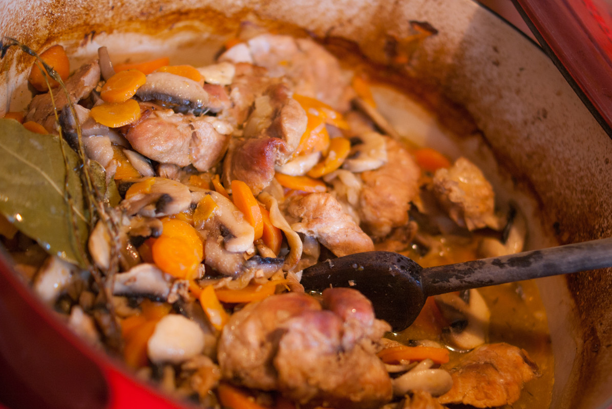

# Araignée de porc au cidre, carottes et champignons
(sans glutten, sans lactose et sans oeuf)  

## Ingrédients
Ingrédients pour 6 à 8 personnes

    Une douzaine d'araignées de porc (environ 1 kg)
    2 oignons
    600 g de carottes
    600 g de champignons de Paris
    75 cl de cidre brut (ou tradition)
    1 CàS de farine de riz
    1 bouquet garni
    Margarine
    Sel et poivre

## Recette
Avec l'hiver qui arrive on aime les petits plats mijotés, au vin blanc, au vin rouge ou encore à la bière, pour se réchauffer. Aujourd'hui, j'ai envie de faire voyager vos papilles dans ma Bretagne natale avec une araignée de porc mijotée au cidre. Située au niveau de l'aine de l'animal, l'araignée est un « morceau de choix », tendre et goûteux.

Pour cette recette, utilisez un plat à mijoter (si possible en fonte émaillée) allant au four. Si vous n'en avez pas, ce n'est pas grave. Une (très) grande casserole ou une grande sauteuse avec leurs couvercles feront l'affaire. (Il faudra cependant surveiller la cuisson sur le feu pour que cela n'attache pas au fond)

Commencez par préchauffer votre four à 200/220°C
Dans votre plat, faites dorer quelques minutes vos araignées de porc. Une fois bien dorées (mais pas cuites) enlevez les du plat et réservez.
Dans le même plat, mettez vos oignons émincés. Faites les blanchir. (Si besoin ajoutez un peu de matière grasse ou d'eau). Une fois les oignons revenus quelques minutes remettez la viande, mélangez. Ajoutez ensuite la farine, remuez bien pour enrober les morceaux de viande. Déglacez ensuite avec un peu d'eau (la valeur d'une petite tasse). Grattez bien le fond de votre plat pour récupérer les sucs de cuisson.
Ajoutez ensuite le bouquet garni, salez, poivrez et arrosez avec le cidre. A la reprise de l'ébullition, ajoutez les carottes coupées en rondelles. Couvrez et laissez mijoter 20 à 30 minutes.
Pendant ce temps, occupez-vous des champignons, épluchez-les et coupez-les. Ajoutez les enfin au reste de votre plat, remuez, couvrez et enfournez à four chaud pendant 45 minutes / 1 heure.
Au bout d'une trentaine de minutes, mélangez, vérifiez l'assaisonnement et remettez au four.

Servez ce plat, tel quel ou accompagné de riz, de pâtes (sans gluten bien sûr) ou de pommes de terre vapeur. Régalez-vous !
