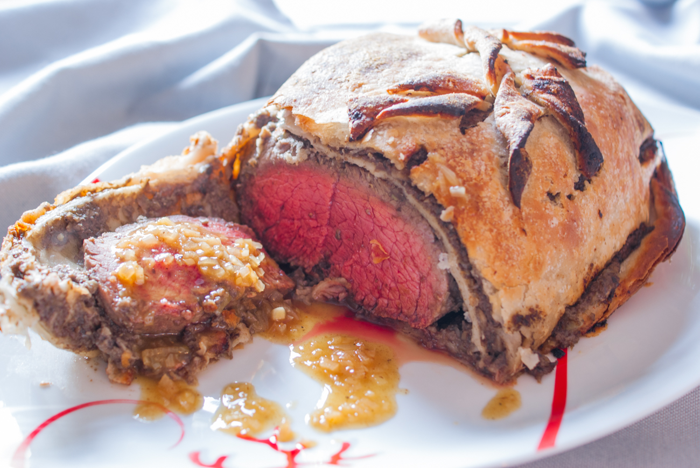

# Bœuf Wellington et sa sauce madère
(sans glutten, sans lactose et sans oeuf)  

## Ingrédients
Ingrédients pour 6 personnes

    1 filet de bœuf de 1,5kg
    2 pâtes feuilletées sans gluten (environ 450g)
    400g de champignons de Paris
    2 échalotes
    Beurre végétal
    Sel et poivre à votre convenance

### Pour la sauce

    1 échalote
    25 cl de madère
    25 cl de bouillon de bœuf
    1 càc de maïzena
    Sel et Poivre à votre convenance

## Recette
Raffiné et festif, le bœuf Wellington est un grand classique de la cuisine anglaise. Il existe plusieurs variantes de cette recette où le bœuf est entouré de champignons et d’échalote puis cuit à l’étouffer dans une pâte feuilletée. Idéal pour les fêtes il saura ravir les papilles de tous ceux qui veulent changer des traditionnels chapons ou dindes.

Nettoyez les champignons et épluchez les échalotes. Hachez finement le tout puis faites-les revenir dans une CàS de beurre végétal. Utilisez pour cela une cocotte suffisamment grande car elle vous servira tout au long de la recette. Laissez réduire jusqu’à ce que l’eau rendue par les champignons se soit évaporée. Salez et poivrez. Réservez dans un autre récipient. Dans la même cocotte, rajoutez 1 CàS de beurre végétal et faites revenir votre filet de bœuf sur toutes ses faces, salez et poivrez.
Faites chauffer votre four à 220°.
Sur un plan de travail, étalez votre/vos pâtes feuilletées et recouvrez-les de votre farce de champignons. Posez le filet de bœuf au centre et enveloppez-le entièrement. Soudez bien les bords en pinçant avec vos doigts. Badigeonnez votre pâte feuilletée d’une cuillère à soupe de beurre végétal fondu et percez quelques petits trous pour laisser s’échapper la vapeur.
Laissez cuire 30 minutes. Attendez une dizaine de minutes avant de découper et servir.

Pendant la cuisson de votre viande, réalisez votre sauce.
Hachez finement une échalote. Dans la même cocotte que vous avez utilisé pour vos champignons et votre viande (sans la laver, pour récupérer les sucs de cuisson), faites suer votre échalote avec une CàS de beurre végétal. Une fois ramollie, versez le madère et laissez réduire. Ajoutez enfin le bouillon de bœuf. Dès ébullition, ajoutez une càc de maïzena délayée dans un peu d’eau. Laissez épaissir. Salez et poivrez à votre convenance. Réservez au chaud et servez en saucière avec votre viande.
