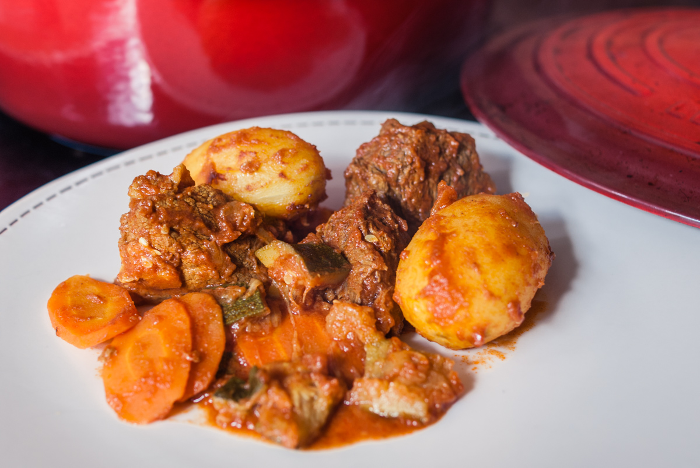

# Bœuf aux épices
(sans glutten, sans lactose et sans oeuf)  

## Ingrédients
Ingrédients pour 6 personnes

    800g à 1kg de Paleron/gîte ou jarret
    2 oignons
    3 carottes
    2 courgettes
    6 pommes de terre
    600g de coulis de tomates nature
    1 càc de cannelle
    1 càc de gingembre en poudre
    1 càc de curcuma
    1 verre d'eau (environ 300ml)
    Huile d'olive

## Recette
L'hiver touche à sa fin mais on aime encore se réchauffer avec de bons petits plats mijotés. Aujourd'hui c'est une recette un peu particulière que je vous propose qui conjugue traditionnel et douces effluves épicées.

Coupez la viande en cubes et faites-la revenir dans un peu d'huile d'olive. Ajoutez les oignons émincés, laissez dorer quelques minutes et ajoutez les épices. Enrobez la viande et les oignons et ajoutez l'eau. Couvrez et laissez mijoter à feu doux environ 30 minutes. Ajoutez ensuite le coulis de tomates et laissez de nouveau mijoter environ 1h30.
Pour ce genre de cuisson, j'utilise une cocotte allant sur les feux et dans le four et je laisse ainsi mijoter à four chaud (180°/200° environ).
Pendant ce temps lavez vos légumes. Épluchez les carottes et détaillez-les en rondelles. Coupez les courgettes en cubes. Épluchez les pommes de terre. Ajoutez les légumes dans votre cocotte, mélangez bien pour qu'ils s'enrobent de sauce, couvrez et laissez de nouveau mijoter 1h environ. Servez bien chaud.
