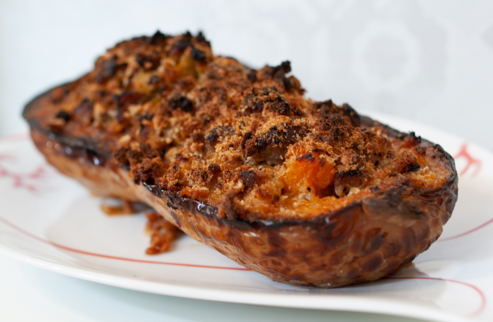

# Butternut farcie
(sans glutten, sans lactose et sans oeuf)  

## Ingrédients
Ingrédients pour 4 personnes

    500g de chair à saucisse
    1 courge butternut
    2 oignons
    1 gousse d’ail
    Des herbes de Provence (facultatif)
    De la chapelure sans gluten
    Sel et poivre à votre convenance
    Huile d’olive

## Recette
La courge butternut ça ne se mange pas qu’en soupe ou en purée, c’est aussi très bon farcie. Je vous propose ici une recette très proche des légumes farcis que je fais avec les légumes d’été ; de quoi mettre du soleil dans les assiettes et dans les cœurs.

Allumez votre four à 180°.
Lavez la courge, enlevez la tête, coupez-la en 2 et épépinez là. Avec un pinceau badigeonnez la chair avec un peu d’huile d’olive, salez et poivrez. Enfournez sur une plaque pour une trentaine de minutes.
Pendant ce temps, émincez l’oignon et faites-le suer dans une cocotte. Ajoutez ensuite la chair à saucisse, l’ail et les herbes de Provence. Laissez mijoter à feu doux en remuant de temps en temps. Salez et poivrez à votre convenance.
Une fois la butternut cuite (la lame du couteau doit s’enfoncer facilement dans la chair), sortez-la du four. A l’aide d’une cuillère vider la chair de sorte à former un creux. Coupez la chair ainsi récupérée en morceaux et mélangez-la à votre chair à saucisse. Remplissez vos deux moitiés de courge avec cette préparation. Saupoudrez de chapelure sans gluten avant d’enfourner de nouveau une quinzaine de minutes.
Servez bien chaud avec pourquoi pas du riz ou du quinoa en accompagnement.
