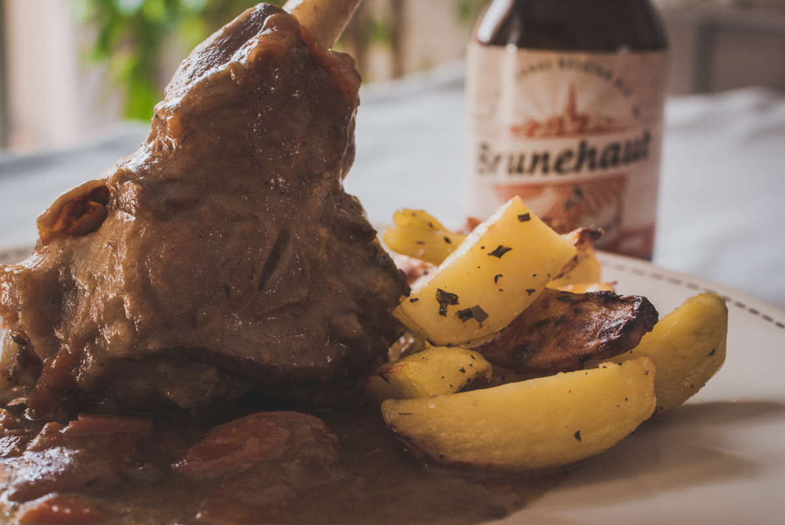

# Carbonnade de souris d'agneau
(sans glutten, sans lactose et sans oeuf)  

## Ingrédients
Pour 4 personnes

    4 souris d'agneau
    2 bières sans gluten
    2 oignons
    6 carottes
    1 CàS rase de farine de riz
    Une grande tranche de pain sans gluten sans la croûte (environ 60g)
    1 CàS de moutarde
    ¼ de càc de 4 épices
    1 CàS de vergeoise (ou de cassonade)
    2 feuilles de laurier sauce
    2/3 brins de thym
    Huile d'olive / beurre végétal
    Sel et poivre

## Recette
Pour Pâques, que diriez-vous d'une recette d'agneau qui change un peu ? Cela faisait longtemps que je voulais tester cette recette et c'est chose faite. Conclusion, j'aurais dû la tester bien avant car c'est délicieux. Mon neveu qui a littéralement dévoré cette carbonnade de souris d'agneau ne vous dira pas le contraire. Recette testée et donc approuvée.

Dans une cocotte allant au four faites dorer les souris d'agneau dans un mélange beurre végétal et huile d'olive. Quand elles sont dorées ajoutez les oignons et remuez. Mouillez légèrement si nécessaire. Ajoutez votre vergeoise et faites dorer. Ajoutez enfin votre farine, mélangez et arrosez votre viande de bière. Ajoutez dans ce mélange les 4 épices, le thym, le laurier, salez et poivrez. Mélangez bien. Plongez dans votre cocotte votre pain sans gluten tartiné de moutarde. Couvrez et laissez mijoter en remuant de temps en temps.
Allumez votre four à 200°. Lavez et épluchez vos carottes. Coupez-les en fines rondelles.
Quand le pain à la moutarde est complètement dissous dans la sauce, ajoutez les carottes. Mélangez, couvrez et enfournez pour 1h30/2h, cela dépend de la taille de vos souris d'agneau. A mi-cuisson, mélangez votre carbonnade.
Servez ce plat avec des pommes de terre vapeur, au four ou comme le veut la tradition dans le Nord, avec des frites. Bon appétit.

> Astuce : Pour la bière j'ai utilisé deux bières ambrées Brunehaut de 33cl. Mais il existe d'autres bières sans gluten. Je vous conseille toutefois une bière ambrée plutôt qu'une bière blonde, votre sauce aura plus de goût. Pour le pain j'ai utilisé du pain campagnard « les recettes de Céliane ». La recette traditionnelle de la carbonnade se fait avec du pain d'épices, il vous faut donc un pain avec une texture similaire. Vous pouvez aussi utiliser du pain d'épices sans gluten, dans ce cas ne mettez pas les 4 épices dans la sauce.
