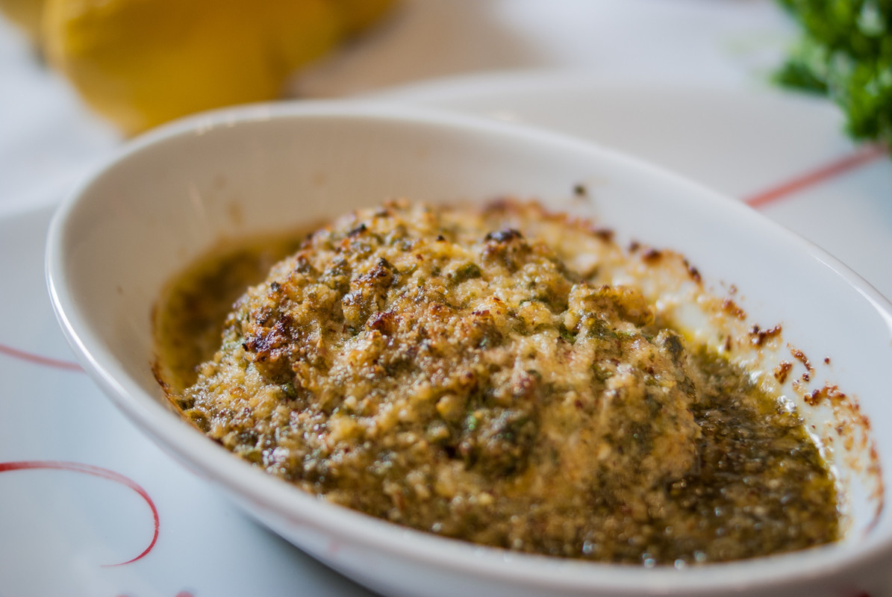

# Dos de cabillaud en croute de noisette
(sans glutten, sans lactose et sans oeuf)  

## Ingrédients
Pour 2 personnes

    1 dos de cabillaud d'environ 400 g
    2 CS de poudre de noisette
    2 (belles) CS de votre beurre végétal habituel
    le zeste d'un citron
    le jus d'1/2 citron
    1 petit bouquet de persil
    1 échalote
    1 cuillère à soupe de vin blanc
    Sel/poivre

## Recette
En entrée ou en plat, le midi ou le soir, le poisson c'est bon. Cuisiné avec une touche de noisette, de citron et de fines herbes c'est encore meilleur. Pour l'accompagnement, vous pouvez varier les plaisirs et les légumes vapeur. Personnellement, j'accompagne toujours ce gratin de brocolis et de pommes de terre à la vapeur.

Préchauffez votre four à 200°C. Rincez le dos de cabillaud à l'eau claire. Bien l'égoutter sur du papier absorbant. Et placez-le dans votre plat allant au four. Hachez Votre persil et votre échalote finement. Dans un récipient, mélangez la poudre de noisettes, le persil et l'échalote. Ajoutez le zeste de citron, le beurre fondu, le jus de citron et le vin blanc. Mélangez. Répartissez votre mélange sur le dos de cabillaud. Celui-ci doit être entièrement recouvert. Enfournez pour 15 minutes. Vérifiez la cuisson, elle peut varier en fonction de l'épaisseur du dos de cabillaud.

> Astuce : Pour ajouter du croquant à la recette, vous pouvez ajouter 2 CS de noisettes grossièrement hachées. Vous n'avez pas/n'aimez pas les noisettes ? Vous pouvez remplacer la poudre de noisettes par de la poudre d'amandes et les noisettes concassées par des amandes effilées. Vous pouvez également séparer votre préparation pour réaliser deux parts individuelles.
