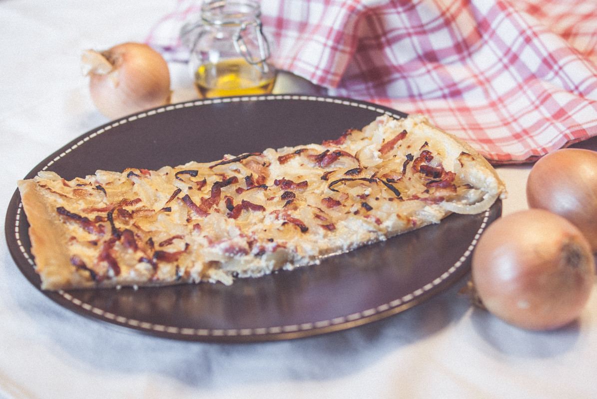

# Flammekueche
(sans glutten, sans lactose et sans oeuf)  

## Ingrédients
Pour une tarte familiale
Plaque d'environ 30x40cm

### Pour le fond
    250g de farine de riz
    5cl d'huile
    10cl d'eau tiède
    1 pincée de sel

### Pour la garniture
    3 oignons
    150g de lardons fumés (en allumettes)
    10cl de vin blanc
    240g de tofu soyeux
    100g d'amande cuisine
    sel et poivre

## Recette
La « tarte Flambée » alsacienne, est une tarte traditionnelle qui était cuite à la flamme du four à pain, d'où son nom qui peut prêter à confusion. Cette tarte composée d'une très fine abaisse de pâte à pain est traditionnellement garnie de crème ou de fromage blanc, d'oignons et de lardons. Je vous propose aujourd'hui de revisiter cette recette sans gluten et sans lactose. Vous ne savez pas quoi manger ce soir ? Faîtes donc voyager vos papilles avec cette recette toute simple.

Commencez par préparer la pâte en mélangeant la farine de riz, le sel, l'huile et l'eau tiède. Ajoutez l'eau petit à petit jusqu'à obtention d'une boule de pâte souple et homogène. Selon la capacité d'absorption de votre farine il vous faudra plus ou moins d'eau. Laissez reposer votre pâte à température ambiante le temps de préparer votre garniture.
Émincez vos oignons et faites les revenir dans un peu d'huile. Ajoutez le vin blanc. A évaporation totale du vin blanc vos oignons sont prêts. Ajoutez vos lardons, mélangez bien. Retirez du feu. Les oignons et les lardons finiront de cuire au four.
Dans un saladier, battez le tofu soyeux et l'amande cuisine jusqu'à obtention d'une crème homogène. Salez et poivrez à votre convenance.
Étalez votre pâte au rouleau entre deux papiers cuisson. Étalez là le plus finement possible. Vous devez être capable de l'étirez pour remplir votre plaque de 30x40 cm. Une fois votre pâte étalée, enlevez le papier cuisson supérieur. (Celui du dessous vous servira pour la cuisson).
Déposez sur votre pâte la crème amande/tofu. Puis répartissez les oignons et les lardons.
Enfournez à four très chaud, 200°/220°C (selon la capacité de votre four) et laissez cuire une quinzaine de minutes. Surveillez la cuisson.

> Astuce : Si la flammekueche traditionnelle est garnie d'oignons et de lardons, il en existe plusieurs variantes gratinées au fromage. Si vous le tolérez, les fromages de chèvre et/ou brebis vous permettront de varier les plaisirs. Pensez aussi aux champignons frais en fines lamelles pour une flammekueche forestière.
