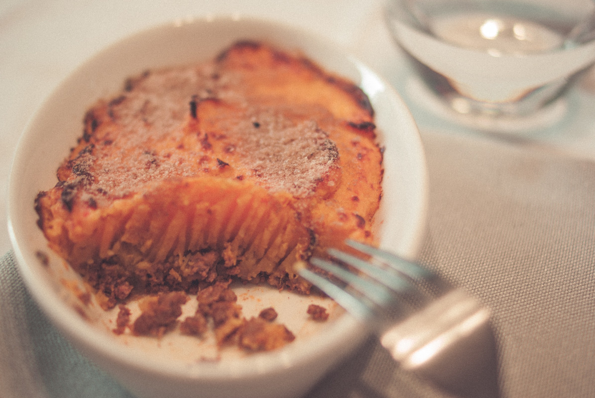

# Hachis Parmentier au potiron
(sans glutten, sans lactose et sans oeuf)  

## Ingrédients
Ingrédients pour 6 personnes

    800g de potiron
    800g de pommes de terre
    beurre végétal
    lait végétal (soja, riz...)
    600g de bœuf haché
    2 oignons
    2 gousses d'ail
    2 CàS de concentré de tomate
    1 càc de paprika
    1 brin de tyhm
    huile d'olive
    sel/poivre
    Chapelure sans gluten (facultatif)

## Recette
Dans les recettes de famille, qui n'aime pas le hachis Parmentier ? Je vous propose aujourd'hui de revisiter cette recette avec les saveurs automnales du potiron.

Pelez et lavez les pommes de terre, détaillez les en morceaux et faites les cuire à la vapeur ou à l'eau. Faites de même avec le potiron. (Il faut mieux les faire cuire séparément car leur temps de cuisson ne sera pas le même).
Pendant ce temps, faites blondir l'oignon dans un peu d'huile d'olive. Ajoutez votre viande, faites la revenir quelques instants puis ajoutez le concentré de tomates, le paprika, le thym et l'ail émincé très finement.  Salez et poivrez à votre convenance. Une fois le bœuf cuit, réservez.

Une fois vos pommes de terre et votre potiron cuits, égouttez les et passez les au presse purée. Si la consistance vous semble trop épaisse n'hésitez pas à ajouter un peu de lait végétal chaud. Salez poivrez à votre convenance et ajoutez un peu de beurre pour une purée plus gourmande.

Répartissez la viande dans un plat à gratin familial ou dans des petits plats individuels. Recouvrez de purée. Pour plus de croustillant ajoutez de la chapelure sans gluten et quelques noix de beurre avant d'enfourner pour 15/20 minutes à 180°.

> Astuce : Pour ma recette j'ai utilisé du potiron, mais, faites-vous plaisir et variez les saveurs cette recette fonctionne aussi très bien avec du potimarron, de la courge butternut, de la courge musquée, etc. Si vous n'avez pas de chapelure sans gluten vous pouvez la faire en pilant des biscottes sans gluten ou des tartines craquantes sans gluten (j'ai utilisé des tartines craquantes sarrasin « pain des fleurs ») Si vous pouvez vous le permettre vous pouvez bien sûr mettre à gratiner avec une râpé de chèvre. Dégusté avec une salade verte, c'est encore meilleur.
