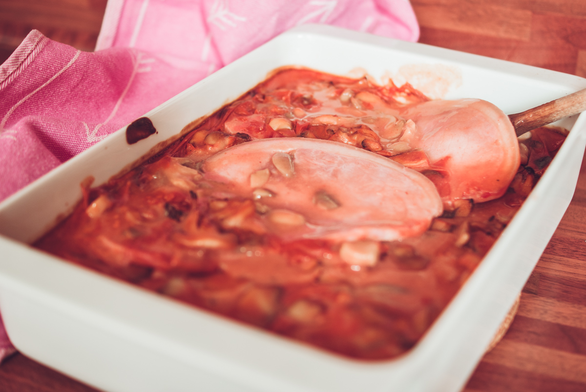

# Jambon au porto
(sans glutten, sans lactose et sans oeuf)  

## Ingrédients
Ingrédients pour 4 personnes

    4 tranches épaisses de jambon sans gluten (ou 8 tranches classiques)
    250g de champignons de Paris (en boîte)
    2 CàS de Maïzena diluées dans 4 CàS d'eau
    15cl de porto
    1 bouillon cube de volaille dissout dans 15 cl d'eau (sans gluten bien sûr -  se trouve facilement en magasin bio)
     CàS de concentré de tomate
    20cl de soja cuisine
    Sel et poivre

## Recette
Aujourd'hui, c'est un plat tout simple à réaliser que je vous propose. Accompagné de pâtes, de riz, de pommes de terre ou encore avec des haricots verts, le jambon au porto, c'est un vrai plat des familles qui fait plaisir l'hiver.

Préchauffez  le four à 210°C.
Égouttez les champignons de Paris. Diluez la Maïzena dans 4 CàS d'eau et faites fondre votre bouillon cube dans 15cl d'eau chaude.
Dans une casserole, portez 15cl de porto à ébullition avec le bouillon de volaille. Versez la Maïzena diluée et faites épaissir à feu doux en mélangeant au fouet. Ajoutez le concentré de tomate et mélangez bien pour bien l'incorporer. Ajoutez enfin la crème et les champignons.  Rectifiez l'assaisonnement en sel et poivre. Faites chauffer pour lier le tout pendant 2/3 minutes.
Disposez les tranches de jambon  dans un plat allant au four. Répartissez la sauce aux champignons entre et au-dessus des tranches de jambon. Enfournez pour une dizaine de minutes pour que les parfums se mélangent.
