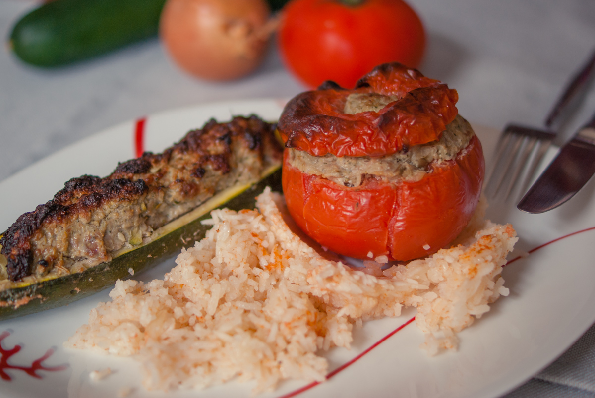

# Légumes farcis
(sans glutten, sans lactose et sans oeuf)  

## Ingrédients
Ingrédients pour un plat familial
Environ 8 pièces

    2 courgettes
    6 tomates
    700g de chair à farcir nature
    2 oignons
    2 gousses d'ail
    1 petit bouquet de persil + ciboulette
    huile d'olive
    sel et poivre
    Chapelure sans gluten (facultatif)
    Bouillon de volaille ou de légumes
    500g de riz

## Recette
La saison des tomates et courgettes commence et le plat qui séduit tout le monde à la maison, ce sont les légumes farcis. Tomates pour monsieur et mini nous, courgettes pour moi. Mais, me direz-vous… dans la farce il faut de la mie de pain et du lait, sinon elle est toute sèche…. Et des œufs sinon elle ne se tient pas ! Et si je vous dis que non, des légumes farcis, c'est possible, sans gluten, sans œufs et sans lactose.

Commencez par laver les courgettes et les tomates. Coupez la partie haute des tomates et conservez le chapeau. Videz les tomates et mettez de côté le jus et la chair. Coupez vos courgettes aux 2/3 dans le sens de la longueur. Videz l'intérieur des courgettes de façon à former une cavité. Conservez les morceaux de chair de courgette.
Dans un plat allant au four, faites un lit avec le riz. Placez dessus vos légumes évidés.
Au mixeur, hachez les oignons, l'ail, le persil, la ciboulette ainsi que la chair de courgette mise de côté. Mélangez le tout à la chair à farcir. Salez et poivrez.
Remplir le contenu de vos légumes avec la préparation viande et légumes. Replacez les chapeaux de vos tomates. Parsemez, si vous le souhaitez de chapelure. Arrosez d'un filet d'huile d'olive.
Passez au mixeur votre chair de tomates mise de côté et passez-la au tamis pour récupérer le jus. Versez ce jus dans votre plat, il servira à cuire votre riz. Complétez avec un bouillon de volaille ou de légumes pour couvrir complètement le riz. Assaisonnez ce jus selon votre goût.
Faire cuire à 180° pendant 45 minutes. Surveillez la cuisson : couvrez si nécessaire en cours de cuisson. De même arrosez le riz en cours de cuisson si nécessaire.
Servir chaud.

> Astuce : Pour la chair à farcir vous pouvez utiliser de la chair à saucisses/ du veau/ un mélange veau+porc/ un mélange porc+bœuf. Attention de vous assurer auprès de votre boucher qu'il n'y a pas d'additif allergène dans la viande hachée…. Ou hachez-la vous-même. Vous pouvez bien sûr utiliser les légumes de votre choix si vous vous assurez qu'il y ait des légumes hachés dans votre chair à farcir pour qu'elle conserve son moelleux.
