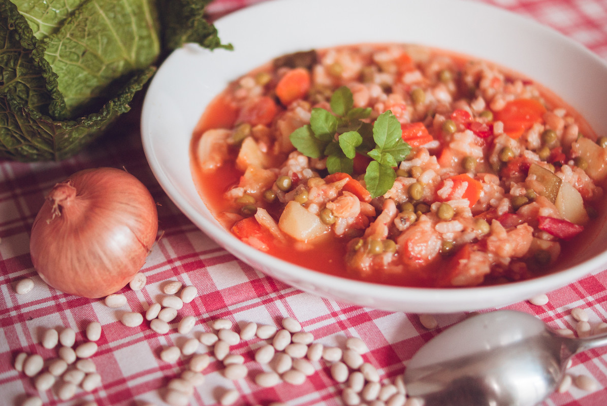

# Minestrone à la milanaise
(sans glutten, sans lactose et sans oeuf)  

## Ingrédients
Ingrédients pour 4 personnes

    40g de lardons
    1 gousse d'ail
    1 oignon
    Quelques brins de persil plat
    1 côte de céleri
    2 CàS d'huile d'olive
    3 tomates pelées épépinées et coupées en dés
    3 carottes coupées en rondelles
    2 pommes de terre coupées en morceaux
    2 petites courgettes coupées en dés
    200g de petits pois écossés
    ½ choux frisé coupé en lanières
    100g de haricots coco
    100g de riz à grains ronds
    4 feuilles de sauge hachées
    8 feuilles de basilic hachées
    Sel/poivre

## Recette
Dans un minestrone, les légumes et les fines herbes côtoient pâtes, riz ou légumes secs, ce qui fait de cette « soupe » un repas complet et roboratif. Chaque région italienne, ou presque, possède sa propre recette. Les minestrones, existent en plat d'été ou d'hiver, chaud ou froid. Personnellement, j'ai une préférence pour les minestrones d'hiver, et, cela tombe bien l'hiver n'est pas loin.

La veille commencez par faire tremper vos haricots coco dans un grand volume d'eau. Ils doivent reposer ainsi une nuit ou une journée entière. Faites les ensuite cuire 1h dans un grand volume d'eau.
Préparation du minestrone : hachez finement les lardons avec l'ail et l'oignon. Lorsque le hachis est assez fin, ajoutez le persil et le céleri, puis hachez de nouveau. Mettez ce mélange dans une casserole, ajouter l'huile, les tomates, les carottes, les pommes de terre et les courgettes. Recouvrez de 2 litres d'eau, salez, poivrez et portez à ébullition à feu vif. Baissez le feu et laissez mijoter très doucement 1 heure.
Ajoutez les petits pois, le chou et les haricots, et laissez mijoter 15 minutes. Ajoutez ensuite le riz et laissez mijoter 20 minutes en remuant de temps à autre. Parfumez avec la sauge et le basilic.
Ce minestrone doit être assez épais. Il se déguste chaud mais s'apprécie également tiède ou froid notamment en été.

> Astuce : Si vous le tolérez, dégustez ce minestrone saupoudré (généreusement) de parmesan.
