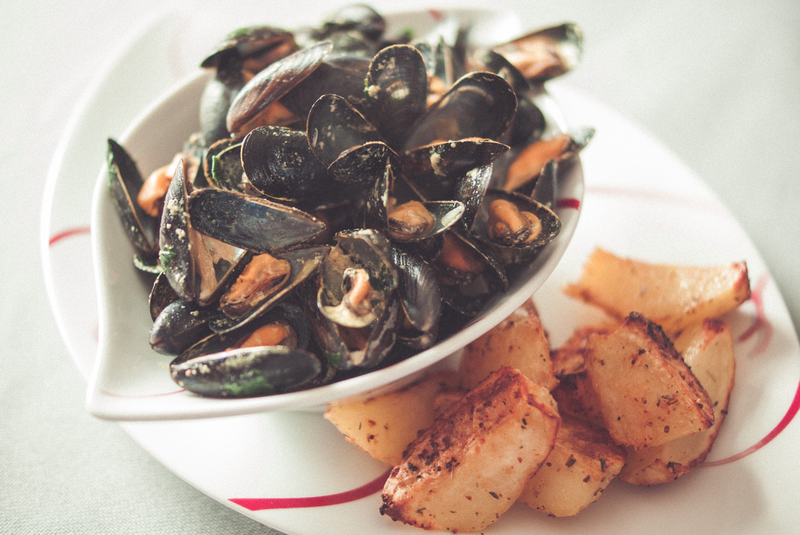

# Moules au curry
(sans glutten, sans lactose et sans oeuf)  

## Ingrédients
Pour 2 personnes

    1,5 lites de moules (La quantité de moules par personne varie selon les appétits ou l'accompagnement)
    1 grosse échalote
    huile d'olive
    1 petit verre de vin blanc sec
    2 càc de curry en poudre
    20cl de crème végétale (soja ou amande cuisine)
    un petit bouquet de persil plat

## Recette
Ce weekend c'est la grande braderie de Lille… Et qui dit braderie, dit moules frites bien sûr ! Je vous propose donc une recette au curry pour changer des traditionnelles moules marinières. A vos fourneaux …. Miam !

Commencez par trier, gratter et rincer vos moules.
Faites revenir l'échalote hachée finement dans un filet d'huile d'olive. Ajoutez le verre de vin blanc et laissez cuire quelques minutes. Jetez vos moules dans la grande casserole, remuez, couvrez et laissez cuire 5 minutes dès la reprise de l'ébullition.
Egouttez les moules (gardez les au chaud) et gardez le jus. Filtrez le et faites le réduire avec le curry. Une fois le jus réduit de moitié, ajoutez la crème végétale. Mélangez, à la première ébullition ajoutez le persil plat lavé et émincé, versez sur les moules et servez aussitôt.
Bon appétit

> Astuce : Vous pouvez servir vos moules accompagnées de frites ou de [potatoes](./Potatoes.md) maison.
