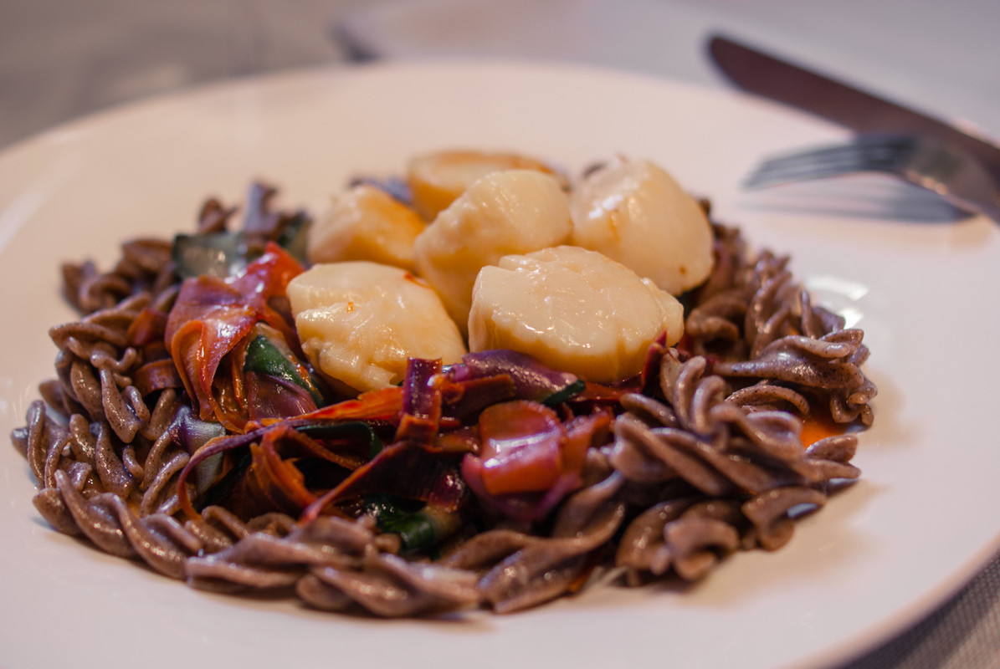

# Noix de St Jacques à la crème de safran, tagliatelles de légumes et tortis au sarrasin
(sans glutten, sans lactose et sans oeuf)  

## Ingrédients
Pour 2 personnes

    240g (environ) de noix de St Jacques (8 à 12 selon la taille de vos St jacques)
    200 ml d'amande cuisine
    125 ml de vin blanc
    1 pincée de safran
    Beurre végétal
    Fleur de sel
    
    1 carotte rouge
    1 carotte orange
    1 petite courgette
    Beurre végétal
    Fleur de sel
    
    70 à 100 g de pâtes 100% sarrasin (en magasin bio)

## Recette
Le compte à rebours a commencé, dans moins d'un mois c'est Noël. Avez-vous déjà pensé à vos menus ? Je vous propose aujourd'hui une recette toute simple de Noix de St Jacques. Pour moi, la noix de St Jacques est la reine des coquillages et cuisinée avec du safran et des tagliatelles de légumes elle fera une entrée pleine de saveurs à vos repas de fête. Si vous voulez en faire un plat, accompagnez vos noix de St Jacques à la crème de safran et de pâtes au sarrasin, ces 3 saveurs se marient très bien.

Les proportions proposées sont pour un plat complet. Si vous souhaitez proposer cette recette en entrée, adaptez les proportions.
Commencez par faire cuire vos pâtes au sarrasin en suivant les instructions du paquet.
Pendant ce temps, snackez vos noix de St Jacques dans une peu de beurre dans une poêle bien chaude. Un allez/retour dans le beurre bien chaud est suffisant, Vous terminerez la cuisson dans la crème de safran. Otez vos noix de St Jacques de la poêle et réservez.
Déglacez votre poêle avec le vin blanc. A la reprise de l'ébullition, incorporez le safran et laissez réduire. Une fois le vin réduit de moitié, ajoutez l'amande cuisine (ou du soja cuisine) et laissez mijoter jusqu'à épaississement.
Pendant ce temps préparez les tagliatelles de légumes.
Pour ma recette j'ai choisi de mettre une carotte rouge. J'aime ce petit goût sucré. Mais, vous pouvez également utiliser deux carottes orange.
Lavez et pelez les carottes. Lavez la courgette (conservez la peau). A l'aide de votre couteau économe réalisez des tagliatelles dans vos légumes. Une fois vos tagliatelles « découpées », faites les revenir quelques minutes, dans un peu de beurre végétal, à la sauteuse. Assaisonnez de fleur de sel et réservez.
Une fois votre crème au safran onctueuse, remettez les Noix de St Jacques dans la poêle et laissez mijoter l'ensemble quelques minutes (selon la taille de vos noix de St Jacques), surveillez la cuisson. Une St Jacques cuite à point reste translucide. Assaisonnez de fleur de sel.

Assemblez ensuite, les tagliatelles de légumes, les pâtes au sarrasin et les St Jacques avec leur crème dans vos assiettes. Servez bien chaud.
