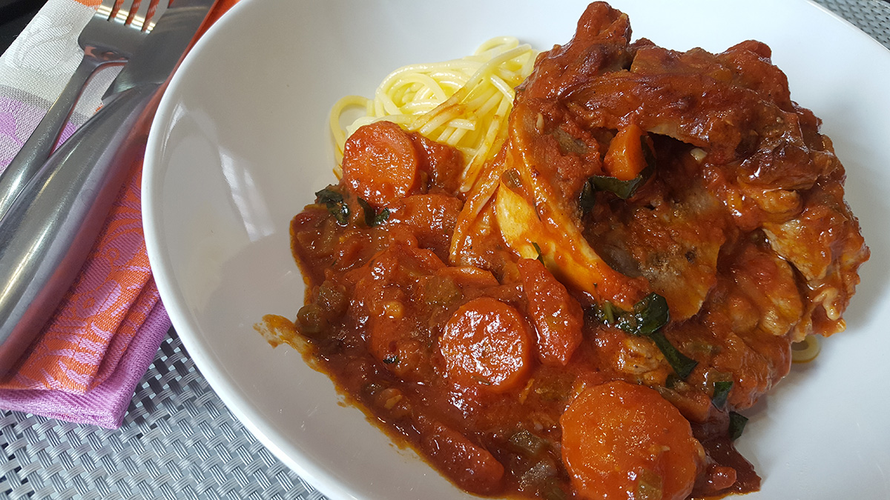

# Osso Bucco à la Milanaise
(sans glutten, sans lactose et sans oeuf)  

## Ingrédients
Ingrédients pour 4 personnes

    4 tranches de jarret de veau
    Farine de riz complet pour enrober les jarrets
    1 gros oignon haché
    2 grosses carottes coupées en rondelles
    1 belle branche de céleri émincée
    500g de tomates concassées
    20 cl de vin blanc sec
    20 cl de bouillon de viande
    Huile d’olive
    Sel et poivre

### Pour la gremolata (facultatif)

    le zeste d1 citron (bio et non traité de préférence)
    2 belles cuillères à soupe de basilic (frais) haché

## Recette
Aujourd’hui c’est une recette qui me tient à cœur que je vous propose puisque c’est certainement LE plat préféré de mon homme. Ce plat traditionnel milanais est à la fois gourmand et familial ; il y a donc autant de variétés de cette recette que de mamas en Italie ;) La mienne est inspirée de ma bible de la cuisine italienne : « la cuillère d’argent » et je l’ai ajustée aux goûts de mon homme qui aime quand il y a beeeaaucoup de sauce ;)

Allumez votre four à 200°.
Dans une cocotte (pouvant se couvrir et allant au four) faites suer l’oignon finement haché 5 minutes à feu doux en remuant régulièrement. Farinez la viande et faites la dorer, sur feu vif,  sur toutes les faces avec les oignons. Salez, poivrez et laissez cuire quelques minutes. Mouillez avec le vin blanc, mélangez bien pour récupérer les sucs de cuisson et laissez réduire  le jus. Ajoutez le céleri finement haché, les carottes en rondelles, mélangez bien et ajoutez les tomates concassées et le bouillon de viande. Couvrez et placez au four chaud pendant 1 heure.
Préparez la gremolata en mélangeant le zeste d’un citron et le basilic frais haché. Au moment de servir, ajoutez la gremolata dans la cocotte et remuez doucement et ajustez l'assaisonnement si nécessaire. Bon appétit.

> Astuce : Traditionnellement, l’osso bucco à la milanaise se déguste avec un risotto à la milanaise. La recette que je vous propose est une recette avec une sauce tomate généreuse. Je vous conseille donc de déguster votre osso bucco avec des pâtes…. Sans gluten bien sûr ;) Et si vous le tolérez, pour ajouter encore en gourmandise, pensez au parmesan ;)
