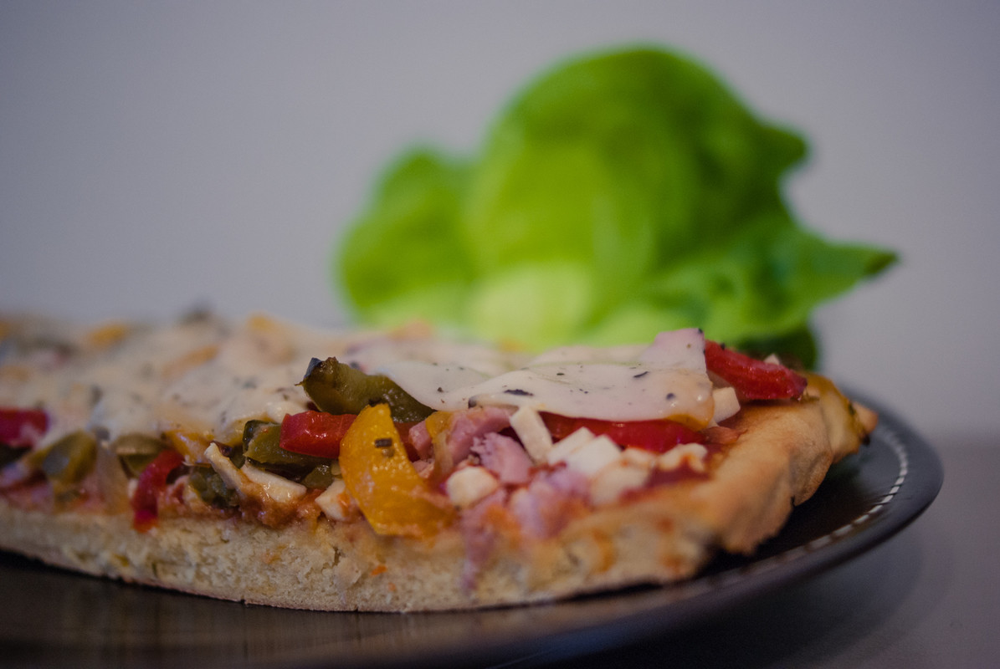

# Pizza aux poivrons 
(sans glutten, sans lactose et sans oeuf)  

## Ingrédients
Pour une pizza familiale
Plaque d'environ 30X40 cm

### Pour le fond
    300g de farine de riz
    200g de farine de pois chiche
    25g de Lev'Quinoa (ou votre levure boulangère sans gluten habituelle. Dans ce cas suivez les indications de proportion)
    10g de sel
    1 CàS d'huile d'olive
    400ml d'eau tiède

### Pour la garniture
    1 petite brique de coulis de tomate nature
    4 tranches de jambon sans gluten
    1 oignon
    3 petits poivrons (rouge/vert/jaune)
    1 CàS d'huile d'olive
    Herbes de Provence
    sel/poivre
    Des fromages végétaux (vegi Cheezly-mozarella environ 100g et Mozzarisella basilic en tranches)

## Recette
Commencez par préparer votre fond de pizza. Mélangez tous les ingrédients dans un saladier avec une cuillère en bois ou au robot à pétrissage jusqu'à obtention d'une pâte souple mais non liquide. Couvrez votre saladier d'un linge humide et laissez pousser environ 1h30 à une température d'environ 20/30°C. (Votre pâte étant sans gluten, elle poussera moins qu'une pâte au blé, n'en soyez pas étonné).
Une fois la pousse terminée étalez votre pâte sur votre plaque recouverte d'un papier cuisson. Laissez de nouveau pousser le temps de préchauffer votre four à 200/220°C. Enfournez pour une quinzaine de minutes. Surveillez la cuisson, votre pâte doit être bien dorée.

Pendant la cuisson de votre fond de pizza, préparez votre garniture de poivrons.
Emincez votre oignon et faites le revenir à l'huile d'olive. Ajoutez vos poivrons lavés, épépinés et émincés. Une fois vos poivrons cuits salez, poivrez et ajoutez les herbes de Provence.

Une fois votre fond de pizza cuit, retournez le sur une plaque et décollez le papier cuisson. Laissez tiédir.

Vous pouvez maintenant procéder au montage de votre pizza. Commencez par répartir le coulis de tomates sur votre fond de pizza. Recouvrez de vegi Cheezly-mozarella que vous aurez préalablement émincé finement. Ajoutez ensuite votre jambon émincé et votre poêlée poivrons/oignon. Recouvrez enfin de Mozzarisella basilic en tranches.

Enfournez à 200°C pour environ 10 minutes. Surveillez la cuisson, une fois le fromage végétal fondu c'est prêt.

> Astuce : Les fromages végétaux proposés dans la recette sont ceux que je trouve dans mon magasin bio habituel. Mais il en existe plusieurs sortes, n'ayez pas peur d'essayer. Si vous tolérez les fromages de chèvre et brebis, faites-vous plaisir, il en existe tellement. Si vous n'aimez pas les fromages végétaux ou que vous n'aimez pas/ne pouvez pas manger de fromage de chèvre/brebis, c'est aussi très bon sans. Enfin, pour la garniture, faites-vous plaisir au gré de vos envies, parce que la cuisine, c'est comme on aime.
