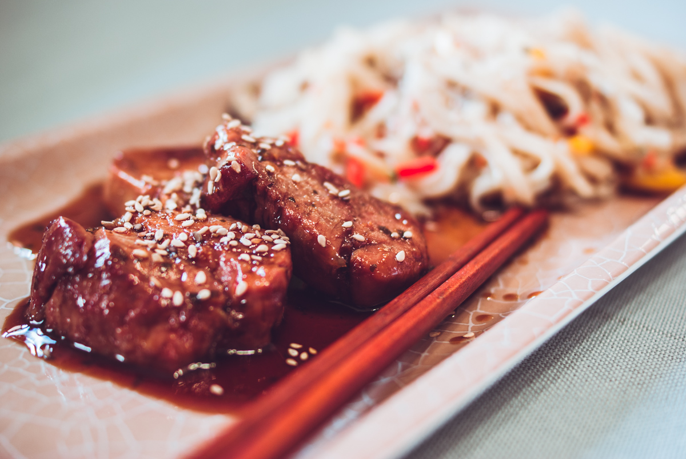

# Porc au caramel
(sans glutten, sans lactose et sans oeuf)  

## Ingrédients
Ingrédients pour 4 personnes

    1 filet mignon de porc d'environ 800g
    4 CàS de miel liquide
    6 CàS de sauce tamari (ou à défaut de sauce soja mais attention elle contient du gluten)
    1 càc de gingembre en poudre
    1 CàS de coriandre fraîche ciselée
    Huile d'olive
    Graines de sésame pour décorer

## Recette
Cette semaine c'est le nouvel an chinois. Pour l'occasion, je vous propose une recette sucrée salée, qui est de loin ma préférée dans les restaurants asiatiques. De souvenir, c'est aussi le plat que j'ai mangé la première fois que je suis allée dans un restaurant chinois. Le porc au caramel a donc pour moi la douce saveur des vacances d'enfance ;) Ce n'est pas la recette originale que je vous propose mais une interprétation qui a mis d'accord ma petite famille.

Commencez par préparer votre sauce. Dans un grand bol mélangez le miel, la sauce tamari le gingembre et la coriandre. Réservez.
Découpez votre filet mignon soit en fines lanières soit en tranches d'environ 2 cm d'épaisseur. Faites revenir dans un peu d'huile d'olive, dans votre wok ou votre sauteuse. Une fois votre viande saisie et dorée (environ 10 minutes si vous optez pour la découpe en tranches – un peu moins si vous faites de fines lanières), versez dessus votre mélange, sauce tamari et miel. Mélangez. A la reprise de l'ébullition laissez sur feu moyen une dizaine de minutes. C'est prêt. Parsemez de graines de sésame avant de servir. Bonne dégustation.

> Astuce : Vous pouvez servir ce plat avec les nouilles de riz sautées aux légumes (comme sur la photo), du riz nature, un wok de légumes… Selon votre gourmandise.
