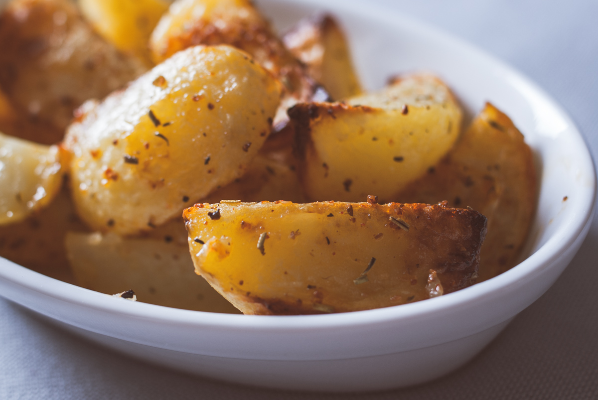

# Potatoes
(sans glutten, sans lactose et sans oeuf)  

## Ingrédients
Ingrédients pour 4 personnes

    8 pommes de terre (environ selon les appétits)
    Huile d'olive
    Paprika doux
    Ail en poudre
    Herbes de Provence
    Sel

## Recette
Qu'elles viennent d'un fast food ou du rayon congélation de votre supermarché, les potatoes, tout le monde aime ça ! Aujourd'hui je vous propose de les faire à la maison…. C'est simple, rapide, économique, plus sain, sans additifs et tellement meilleur !

Allumez votre four à 200°.
Lavez et épluchez vos pommes de terre. Coupez-les en quartiers et disposez-les dans un plat allant au four. Arrosez vos pommes de terre d'un filet d'huile d'olive. Ajoutez du paprika, de l'ail en poudre et des herbes de Provence. Mélangez le tout pour bien enrober vos pommes de terre.
Pour une fois je ne vous indique pas de quantités, parce que la cuisine c'est aussi comme on aime, à vous de doser l'assaisonnement selon vos préférences.
Enfournez pour une trentaine de minutes. A mi-cuisson, mélangez vos pommes de terre pour qu'elles aient une cuisson uniforme.
Avant de servir, salez vos pommes de terre et mélangez de nouveau.
Idéal en accompagnement pour vos viandes, burgers, moules…..
