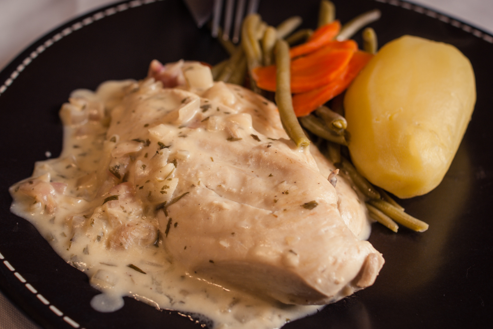

# Poulet à l'estragon 
(sans glutten, sans lactose et sans oeuf)  

## Ingrédients
Pour 2 personnes

    2 Filets de Poulet
    2 belles échalotes
    20 cl de vin Blanc
    25cl d'amande (ou de soja) cuisine
    Quelques brins d'estragon (ou 1 cuillère à soupe d'estragon en poudre)
    Huile d'olive
    Sel et poivre

## Recette

Le poulet à l'estragon est une recette toute simple, traditionnelle et tout le monde aime ça. A servir avec du riz, des pâtes sans gluten, des pommes de terre vapeur ou encore des légumes… Un vrai délice rapide à préparer.

Dans une sauteuse faites revenir les échalotes finement hachées avec un peu d'huile d'olive. Ajoutez les blancs de poulet et faites les dorer. Déglacez avec le vin blanc et ajoutez l'estragon finement haché. Salez et poivrez à votre convenance. Laissez mijoter à couvert une dizaine de minutes. Enlevez ensuite le couvercle et laissez le vin blanc s'évaporer, environ une dizaine de minutes. (Retournez les blancs de temps en temps pour une cuisson uniforme). Incorporez votre crème végétale et laissez mijoter à feu doux le temps pour votre sauce d'épaissir et de napper les blancs de poulet.
Servez avec l'accompagnement de votre choix et régalez-vous.
