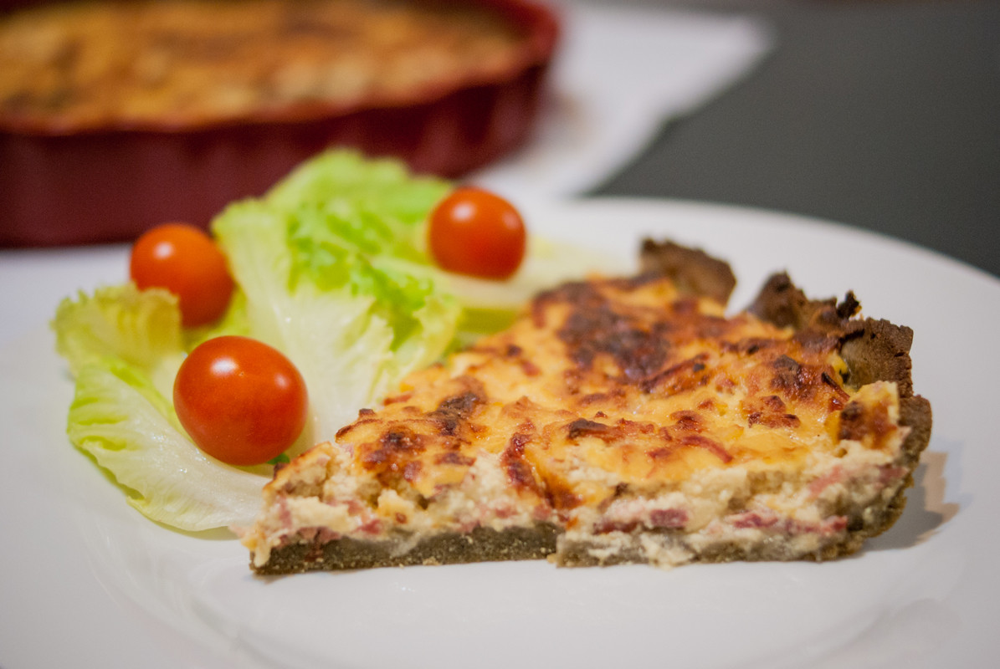

# Quiche à la farine de lentilles verte et au jambon
(sans glutten, sans lactose et sans oeuf)  

## Ingrédients

Pour un plat à tarte de 28/30 cm de diamètre 6 personnes

### Pour la pâte « brisée » salée
    150g de farine de riz
    110g de farine de lentilles vertes
    1 pincée de sel
    1càc de mix'Gom (facultatif)
    85g d'huile végétale
    105ml d'eau

### Appareil à quiche
    400g de tofu soyeux
    200ml d'amande cuisine
    3CS de farine de lupin (à défaut de la farine de riz ou de lentilles vertes)
    Sel+poivre

### Garniture
    150g de jambon émincé (Attention à prendre une marque ne contenant pas de gluten)
    70g de fromage de chèvre/brebis râpé (Si toutefois vous tolérez le lactose de chèvre et de brebis. Si ce n'est pas le cas, c'est aussi très bon sans)

## Recette

S'il y a bien une recette qu'il faut bannir quand on est intolérant au gluten, au lactose et aux œufs, c'est la quiche. Pour moi qui adore les tartes salées, cela a été un de mes premiers défis : trouver des ingrédients de substitution pour pouvoir continuer à me régaler le soir avec une petite salade. Le plus de cette recette ? Tellement plus crémeuse en bouche qu'une quiche « classique », un vrai régal.

### Préparation de la pâte « brisée » salée

A cause de l'absence de gluten et d'œuf, cette pâte est beaucoup plus friable qu'une pâte brisée classique.

Dans un récipient, mélangez l'ensemble des ingrédients secs. Ajoutez ensuite l'huile végétale, mélangez. Ajoutez petit à petit l'eau jusqu'à obtention d'une pâte homogène qui puisse former une boule. Laisser reposer votre pâte 1 à 2 heures au frais -préchauffez votre four à 200°C

Avant de préparer votre appareil à quiche, étalez votre pâte à la main dans votre plat à tarte préalablement huilé. (Oui, étalez votre pâte à la main, et pas au rouleau car celle-ci est beaucoup plus friable qu'une pâte brisée classique)

Faites précuire votre fond de tarte à blanc pendant environ 10 minutes. Pendant ce temps, préparez votre appareil à quiche.

### L'appareil  à quiche

Dans un récipient, mélangez jusqu'à obtenir un mélange crémeux et homogène, le tofu soyeux, l'amande cuisine, la farine de lupin, le sel et le poivre. Ajoutez ensuite votre garniture et mélangez. Versez, cette préparation sur votre fond de tarte précuit. Enfournez pour une trentaine de minutes à 200°C. Une fois la quiche bien dorée, sortez la du four et attendez une quinzaine de minutes avant de servir.

L'appareil au tofu doit redescendre en température pour se tenir à la découpe de la tarte. Astuces : Vous pouvez ajouter les ingrédients de votre choix à l'appareil à quiche (champignons/petits dés de tomates/tomates cerise/brunoise de légumes divers comme la courgette…). Cependant si vous choisissez cette option versez au préalable 3 CS de semoule de riz sur votre fond de tarte avant d'y ajouter l'appareil. La semoule de riz absorbera l'humidité issue des légumes et cela évitera à votre pâte de ramollir.

> Astuce : Vous pouvez ajouter les ingrédients de votre choix à l'appareil à quiche (champignons/petits dés de tomates/tomates cerise/brunoise de légumes divers comme la courgette...). Cependant si vous choisissez cette option versez au préalable 3 CS de semoule de riz sur votre fond de tarte avant d'y ajouter l'appareil. La semoule de riz absorbera l'humidité issue des légumes et cela évitera à votre pâte de ramollir.
