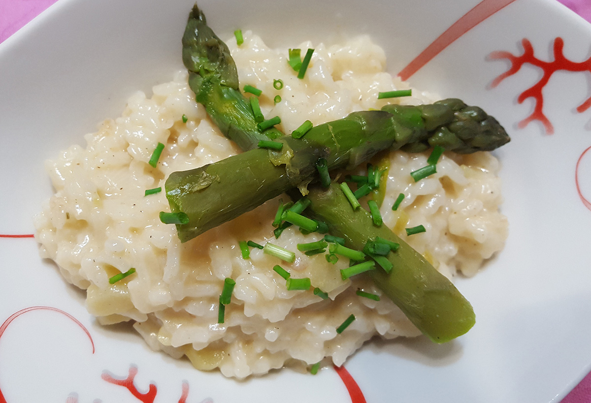

# Risotto aux asperges vertes fraîches
(sans glutten, sans lactose et sans oeuf)  

## Ingrédients
Ingrédients pour 4 personnes

    1 botte d'asperges vertes
    2 grosses échalotes
    300g de riz Arborio
    20 cl de vin blanc
    1 litre de bouillon de légumes chaud
    1 filet d'huile d'olive
    1 CàS de beurre végétal
    10 cl d'amande ou soja cuisine (ou tout autre crème végétale de votre choix)
    Sel et Poivre

## Recette
C'est la pleine saison des asperges, on en trouve sur les étals des primeurs jusqu'à mi-juin environ. Il est donc plus que temps de vous confier ma recette de risotto aux asperges vertes… Elle fait généralement l'unanimité et il n'y a jamais de restes ;)

Commencez par laver vos asperges. Cassez le bas, partie la plus dure, et si nécessaire, pellez-les. Coupez les têtes (environ le tiers supérieur de l'asperge), et réservez-les. Coupez le reste en petits tronçons n'excédant pas ½ cm de large.
Avant de commencer votre risotto, mettez vos pointes d'asperge à cuire à la vapeur. (La cuisson à la vapeur permet de conserver leur goût, leur qualité nutritive et leur couleur). Vos têtes d'asperges seront cuites en même temps que votre risotto.
Dans une grande casserole, faites suer les échalotes finement émincées avec un filet d'huile d'olive et le beurre végétal. Ajoutez les tronçons d'asperges (sans les pointes) et mélangez quelques minutes. Ajoutez ensuite le riz et remuez jusqu'à ce que les grains soient translucides. Déglacez au vin blanc. Une fois tout le vin absorbé, ajoutez votre bouillon louche par louche jusqu'à ce que celui-ci soit entièrement absorbé. Ne cessez jamais de remuer. Une fois tout le bouillon absorbé, vérifier la cuisson du riz, il doit être al dente et crémeux. A ce moment, poivrez et éventuellement ajoutez du sel (attention si votre bouillon de légumes est salé il n'y aura pas besoin d'en ajouter). En fin de cuisson ajoutez le soja (ou amande) cuisine. Répartissez le risotto dans vos assiettes et décorez avec les pointes d'asperges.

> Astuce : Si vous n'êtes pas intolérant, en fin de cuisson, après la crème végétale (qui peut être remplacée par une crème fraiche traditionnelle), ajoutez 100g de parmesan râpé à votre risotto et mélangez.
