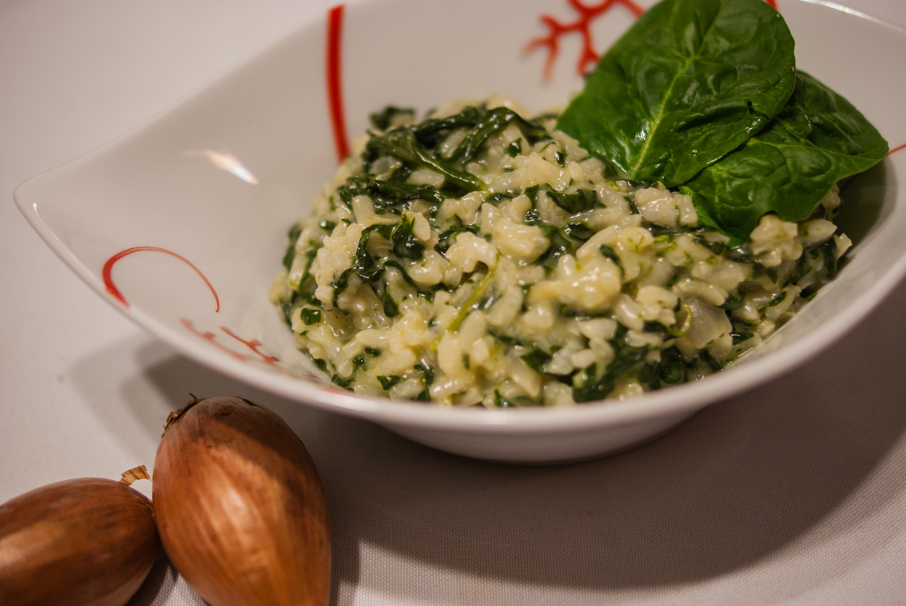

# Risotto aux épinards
(sans glutten, sans lactose et sans oeuf)  

## Ingrédients
Ingrédients pour 4 à 6 personnes

    400g de riz arborio
    600g d’épinards frais
    2 échalotes
    1.5l de bouillon de volaille
    20cl d’amande ou soja cuisine
    beurre végétal

## Recette
Une recette toute simple, bonne, saine et qui va faire manger des épinards à toute la famille.

Commencez par laver vos épinards. Enlevez les queues et les parties abîmées des feuilles. Coupez-les en lanières et faites les fondre dans une cuillère à soupe de beurre végétal pendant environ 5 minutes.
Préparez ensuite le risotto. Émincez vos échalotes et faites les revenir dans une cuillère à soupe de beurre végétal. Ajoutez ensuite votre riz. Faites revenir 1 à 2 minutes. Puis ajoutez une louche de bouillon de volaille. Laissez absorber en remuant. Renouvelez l’opération jusqu’à ce qu’il n’y ai plus de bouillon. Lorsque vous ajoutez la dernière louche de bouillon ajoutez aussi les épinards en continuant de remuer jusqu’à absorption complète du bouillon. Ajoutez ensuite l’amande cuisine et remuez. Servez bien chaud.

> Astuce : Vous pouvez bien sur utiliser des épinards surgelés ou en conserve. Si vous le tolérez, ajoutez 75g de parmesan en fin de cuisson et mélangez avant de servir. Vous pouvez également ajouter le zeste d’un citron et des quartiers de citron avant de servir. Ces saveurs se marient très bien avec les épinards.
