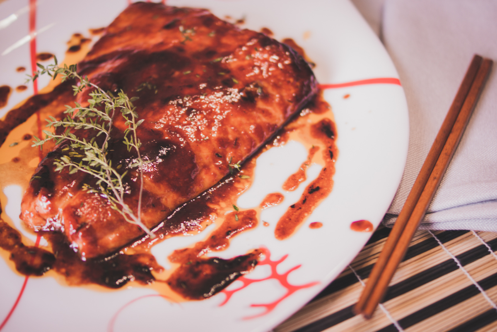

# Saumon laqué, miel tomate et tamari 
(sans glutten, sans lactose et sans oeuf)  

## Ingrédients
Ingrédients pour 4 personnes

    4 pavés de saumon ou 1 filet
    2 brins de thym
    2 CàS de concentré de tomate
    4 CàS de sauce tamari (ou de sauce soja salée)
    4 CàS d'huile d'olive
    2 CàS de jus de citron
    Poivre

## Recette
Si vous aimez le saumon,  voici une recette de marinade aux saveurs asiatiques, ou comment mettre un coup de peps à votre saumon habituel.

Préparez la marinade dans un plat allant au four en mélangeant, le concentré de tomate, la sauce tamari, l'huile d'olive, le jus de citron, le poivre ainsi qu'un brin de thym effeuillé.
Ajoutez votre saumon et enrobez-le de la marinade. Filmez et placez au frais pour au moins 2 heures.
Préchauffez votre four à 180°.
Avant la cuisson, prenez soin d'enrober de nouveau votre saumon de marinade. Enfournez pour 20 minutes en prenant soin d'arroser de marinade votre saumon à mi-cuisson.
Avant de servir effeuillez le deuxième brin de thym sur votre saumon. Servez bien chaud.

> Astuce : Si vous aimez les sauces relevées, vous pouvez remplacer le concentré de tomate par de la sauce sriracha. La sauce soja contenant du gluten, il est préférable de la remplacer par de la sauce tamari, également issue de la fermentation des fèves de soja. Vous pouvez accompagner votre poisson d'un wok de nouilles de riz sautées aux légumes.
