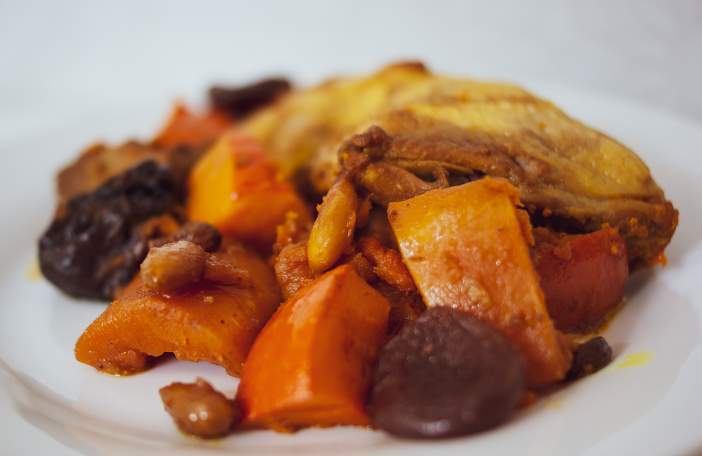

# Tajine d'automne au poulet et fruits secs
(sans glutten, sans lactose et sans oeuf)  

## Ingrédients
Ingrédients pour 4 personnes

    4 cuisses de poulet
    400g de chair de courge butternut
    400g de chair de potimarron
    12 abricots secs
    8 pruneaux
    1 poignée d'amandes mondées (amandes entières débarrassées de leur peau)
    1 poignée de raisins secs
    1 CàS d'huile d'olive
    2 gousses d'ail
    1 clou de girofle
    1 CàS de curcuma
    1 bâton de cannelle
    Sel et Poivre à votre convenance

## Recette
S'il y a bien une saison ou j'adore cuisiner, c'est à l'automne. J'aime particulièrement les courges, potirons et potimarrons d'automne, leurs saveurs se marient bien avec les épices et les fruits secs. C'est donc une recette de tajine que je vous propose aujourd'hui ; en espérant qu'elle mette un peu de soleil dans vos assiettes.

Lavez et coupez en morceaux la butternut et le potimarron. Si la courge butternut a besoin d'être débarrassée de sa peau dure, ce n'est pas le cas du potimarron, à la cuisson elle devient fondante. Pelez les gousses d'ail et hachez-les.
Versez l'huile dans la cocotte, la sauteuse ou le plat à tajine. Faites colorer les cuisses de poulet, l'ail et les amandes. Saupoudrez de curcuma et laissez cuire 10 minutes.
Ajoutez la courge butternut, le potimarron, les abricots secs, les pruneaux, les raisins secs, le clou de girofle et le bâton de cannelle. Salez et poivrez à votre convenance.
Ajoutez un petit verre d'eau, couvrez et laissez mijoter à feu doux pendant 45 minutes.
Servez bien chaud.

> Astuce : Vous pouvez saupoudrer de persil plat ou de coriandre avant de servir. Vous pouvez également accompagner ce plat de semoule de maïs ou de riz, sans gluten bien sûr.
