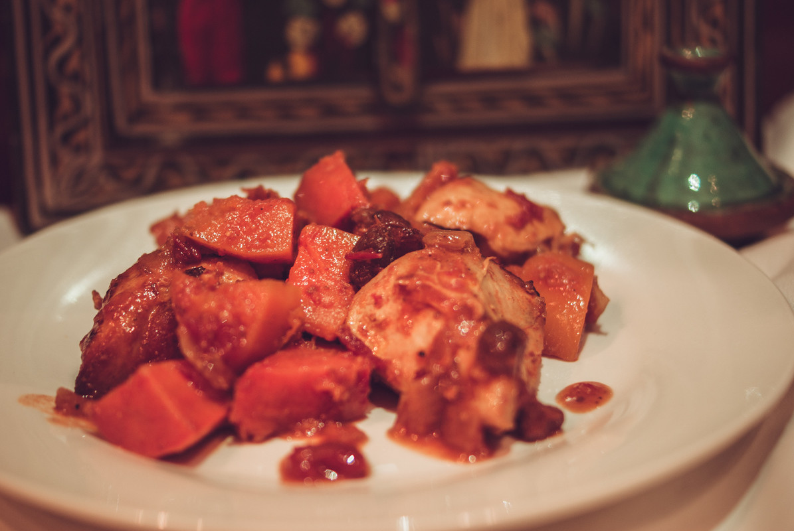

# Tajine de poulet, butternut et patate douce
(sans glutten, sans lactose et sans oeuf)  

## Ingrédients
Ingrédients pour 6 personnes

    6 filets de poulet
    1 courge butternut
    1 patate douce
    1 petite boite de concassé de tomates nature
    2 oignons
    2 gousses d'ail
    100g de raisins secs
    1 CàS de miel
    ½ càc de gingembre en poudre
    ½ càc de cumin
    2 càc de ras el hanout
    huile d'olive

## Recette
On cuisine souvent la courge butternut en purée. Pourtant sa chair ferme et douce mérite de ne pas se faire écraser. Cuisinée en tajine avec de la patate douce et des épices douce, la butternut vous offre un vrai plat d'automne. Si vous n'avez pas de plat à tajine, pas de panique, je n'en ai pas non plus… J'ai utilisé ma cocotte en fonte pour une cuisson douce au four.

Allumez votre four à 180°.
Dans votre cocotte, faites revenir à feu doux les oignons émincés et l'ail écrasé sur un filet d'huile d'olive. Ajoutez les filets de poulet, et faites les dorer quelques minutes sur chaque face. Ajoutez les épices, le miel et une petite tasse d'eau (environ 125ml). Couvrez et laissez mijoter 20/30 minutes.
Pendant ce temps, lavez et épluchez votre patate douce et votre butternut. Coupez-les en gros cubes.
Dans votre cocotte, ajoutez la boite de concassé de tomates, les raisins secs, la butternut et la patate douce. Mélangez bien. Couvez le tout et enfournez pour 30 / 40 minutes. Surveillez la cuisson. Si votre cocotte ne va pas au four, vous pouvez continuer la cuisson à feu doux sur votre plaque ou votre gazinière (l'important étant que la cuisson se fasse doucement et à couvert).
Servez bien chaud.

> Astuce : Vous pouvez, en plus des raisins (ou à la place), mettre des abricots secs. Pour les plus gourmands, ou les plus gros appétits, vous pouvez également accompagner votre tajine de semoule. Il en existe sans gluten, à base de riz ou de maïs.
