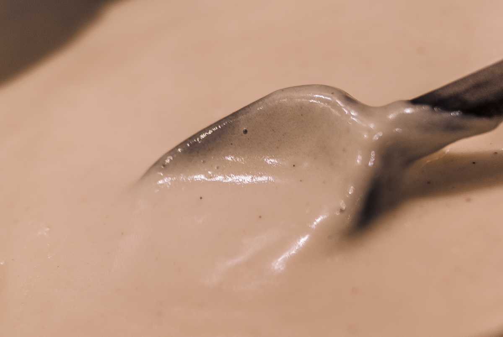

# Sauce béchamel
(sans glutten, sans lactose et sans oeuf)  

## Ingrédients
    90g de farine de riz
    90g de beurre végétal
    1 CàS de fécule de pomme de terre
    1 litre de lait végétal (soja ou riz)
    sel poivre
    Muscade râpée (facultatif)

## Recette
La sauce béchamel est une sauce blanche française, préparée à partir d'un roux cuit avec du lait ou de la crème. Il s'agit d'une sauce mère utilisée dans de nombreuses recettes. Sans gluten et sans lactose, c'est tout de suite plus compliqué d'obtenir la texture onctueuse et crémeuse que l'on aime tous. Pas de panique, voici la solution.

Dans une casserole, faites fondre le beurre végétal avec la farine en mélangeant bien. Ajoutez ensuite progressivement le lait végétal, sans cesser de remuer, jusqu'à ce que la sauce épaississe. Lorsqu'il vous reste la valeur d'un petit verre de lait végétal, mélangez le avec la fécule de pomme de terre et versez ce mélange dans votre casserole, continuez de mélanger. A la reprise de l'ébullition, salez et poivrez et ajoutez la noix de muscade râpée.

> Astuce : On peut ajouter plus ou moins de lait selon la consistance souhaitée : béchamel liquide ou très épaisse. On peut également réaliser une sauce béchamel « rapide » en utilisant de la Maïzena. Dans ce cas délayez 80g de Maïzena dans 1 litre de lait végétal froid. Faites épaissir sur feux, sans cesser de remuer. En fin de cuisson, ajoutez 40g de beurre végétal. Salez et poivrez.
