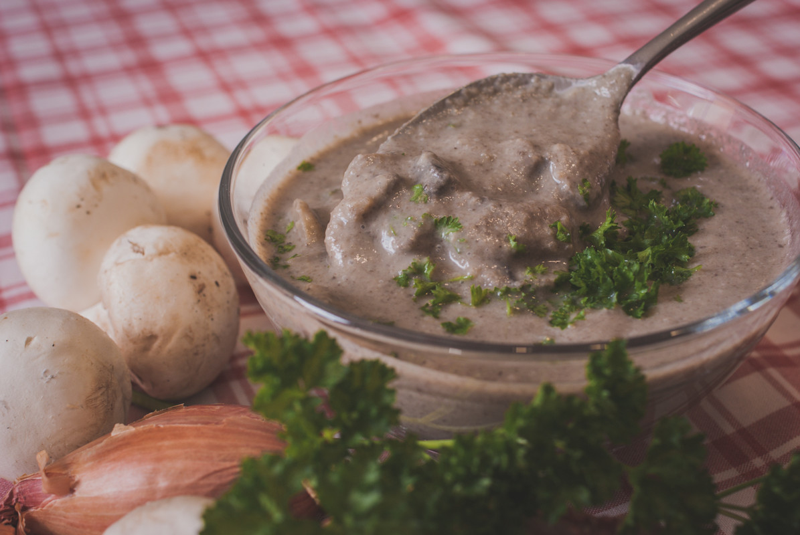

# Sauce forestière
(sans glutten, sans lactose et sans oeuf)  

## Ingrédients
Ingrédients pour 4/6 portions

    250g de champignons de Paris
    1 échalote
    1 cuillère à soupe d'huile d'olive (ou de beurre végétal)
    12,5 cl de vin blanc
    250 cl d'eau
    1 bouillon cube (légumes ou volaille)
    100 cl d'amande (ou soja) cuisine
    sel et poivre

## Recette
La sauce forestière est un bel accompagnement pour une multitude de viandes. Elle se marie très bien avec une viande blanche, une viande rouge et même avec un cabillaud c'est un régal. Avec des pâtes, des pommes de terre ou encore du riz, selon vos envies, cette sauce saura ravir vos papilles.

Epluchez et émincez l'échalote puis faites de même avec les champignons de Paris. Faites les ensuite revenir quelques minutes dans une casserole avec la matière grasse. Ajoutez le vin blanc, l'eau et le bouillon cube. Laissez cuire une vingtaine de minutes.
Une fois les champignons cuits, prélevez en quelques cuillères (environ ¼) et réservez-les. A l'aide d'un mixer plongeur à soupe (ou dans un blender) mixer le reste de la préparation. Ajoutez la crème végétale (amande ou soja cuisine) et émulsionnez de nouveau. Ajoutez à la préparation les champignons mis de côté, salez et poivrez et remettez sur le feu 1 minute environ. Attention, le bouillon cube étant généralement salé, goûtez la sauce avant de remettre du sel.

> Astuce : Pour plus de saveurs, au moment de servir vous pouvez présenter votre sauce avec un peu de persil (ou de ciboulette) ciselé.
