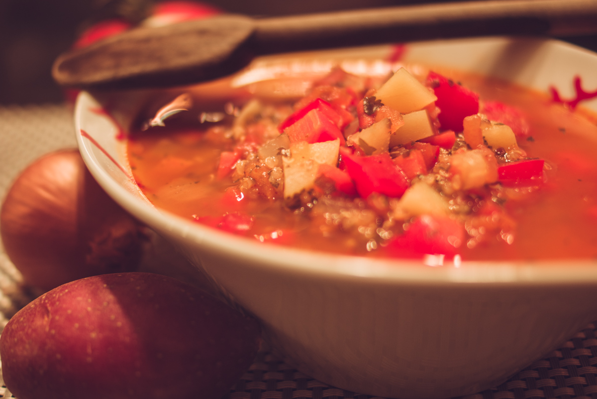

# Soupe de Quinoa 
(sans glutten, sans lactose et sans oeuf)  

## Ingrédients
Ingrédients pour 4 personnes

    100g de quinoa
    1 oignon
    1 belle gousse d'ail
    1 grosse branche de Céleri
    2 carottes
    1 poivron rouge
    4 petites tomates
    4 petites pommes de terre (300/350 g)
    2 CàS de concentré de tomate
    1,5 litre de bouillon de volaille dégraissé
    1 càc de cumin moulu
    1 bouquet de persil
    1 bouquet de coriandre
    huile d'olive

## Recette
Cette soupe de quinoa est inspirée de soupes du Pérou ou de Bolivie. Une soupe réconfortante qui est un véritable plat puisqu'elle est composée de céréales et de légumes.

Commencez par laver, éplucher et couper vos légumes en petits cubes. Réservez-les séparément.
Dans une grande casserole, faites revenir l'oignon dans un peu d'huile d'olive. Une fois l'oignon translucide, ajoutez le céleri et la carotte. Mouillez d'un peu de bouillon de volaille si nécessaire. Faites cuire quelques minutes puis ajoutez le poivron, la tomate et les pommes de terre, mélangez et ajoutez le concentré de tomate, l'ail écrasé et le cumin moulu. Mélangez et couvrez avec le bouillon de volaille. Couvrez. A ébullition, baissez le feu et laissez mijoter une vingtaine de minutes.
Incorporez le quinoa et laissez cuire 20-25 minutes. En fin de cuisson, rectifiez l'assaisonnement (sel-poivre-cumin) et ajoutez le persil et la coriandre émincés.
Servez bien chaud.

> Astuce : Les soupes de quinoa se servent traditionnellement avec du fromage frais, si vous le tolérez, vous pouvez donc servir votre soupe agrémentée de petits cubes de fromage type feta.
