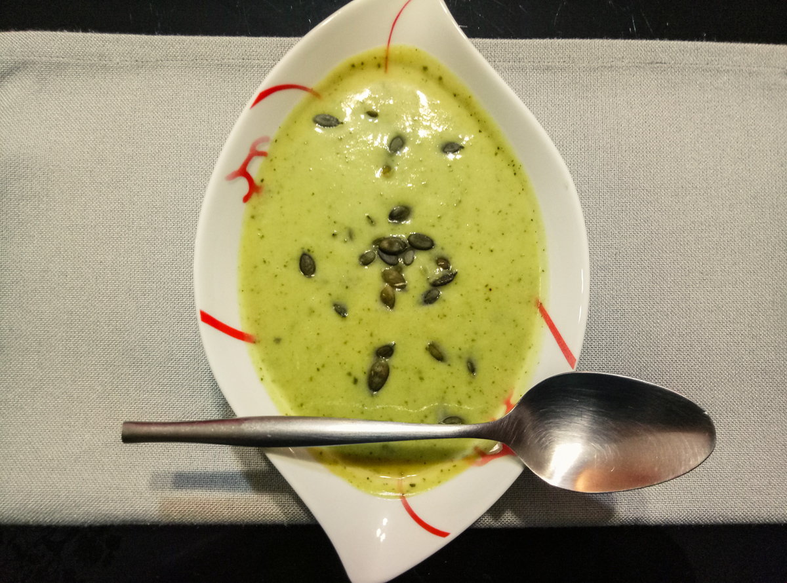

# Velouté de courgettes
(sans glutten, sans lactose et sans oeuf)  

## Ingrédients
Ingrédients pour 4/6 personnes

    4 petites courgettes (bio de préférence)
    2 oignons
    6 gousses d'ail (4 si vous préférez un goût plus doux)
    100ml de crème végétale (soja ou amande cuisine)
    Huile d'olive
    Sel et poivre

## Recette
A la maison, on adore la soupe, les veloutés et les potages. Et, celui qui est certainement dans mon top 3 depuis l'enfance, c'est le velouté de courgettes. Cette recette c'est celle de mon papa que j'ai un peu modifiée en remplaçant la crème fraîche par une crème végétale.

Commencez par épluchez votre ail et vos oignons (en prenant soin d'enlever les germes si nécessaire). Émincez les et faites les revenir dans un peu d'huile d'olive.
Pendant ce temps lavez les courgettes et enlevez les pédoncules. Ne les épluchez pas, cela donnera un bel aspect à votre velouté une fois mouliné. Et puis, c'est bien connu, les vitamines sont dans la peau. Coupez vos courgettes en morceaux et faites les revenir avec les oignons et l'ail.
Couvrez juste d'eau, mélangez et portez à ébullition. Couvrez et laissez cuire une vingtaine de minutes.
Une fois vos courgettes cuites. Mixez avec la crème végétale de votre choix, du sel et du poivre à votre convenance.
Servez bien chaud ;)

> Astuce : Servez votre velouté avec un topping : graines de courge/ Croûtons à l'ail ou nature sans gluten/ des herbes aromatiques… Bref faites-vous plaisir car la cuisine c'est comme on aime ;)
