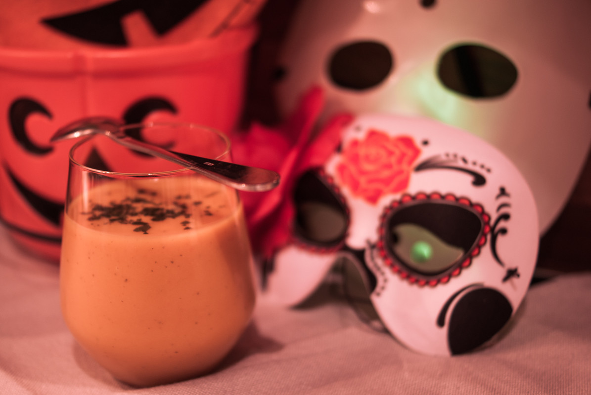

# Velouté de potiron, carottes, coco et curcuma
(sans glutten, sans lactose et sans oeuf)  

## Ingrédients
Ingrédients pour 4 à 6 personnes

    1 kg de chair de potiron
    4 carottes (ou 6 si elles sont petites)
    1 gros oignon
    2 gousses d'ail
    1 petit bouquet de coriandre
    1 càc rase de curcuma
    1 litre de bouillon de volaille
    20 cl de lait de coco
    huile d'olive

## Recette
Le potiron et autres courges, avec leurs belles couleurs, sont associés à l'automne. Je vous propose aujourd'hui, pour vous réchauffer, après votre tournée de bonbons pour Halloween, un petit velouté de potiron. Tout doux avec son léger goût de coco et revigorant grâce au curcuma.

Faites suer les oignons dans l'huile d'olive. Ajoutez les carottes coupées en rondelles puis l'ail et la coriandre émincés et enfin le curcuma. Remuez pendant quelques minutes pour que le curcuma puisse dégager tout son parfum. Ajoutez ensuite le potiron et les pommes de terre taillés en gros cubes. Ajoutez le bouillon de volaille, couvrez et laissez cuire environ 30 minutes.
Quand les légumes sont cuits, retirez du feu, ajoutez le lait de coco et mixez jusqu'à obtention d'un velouté. Rectifiez l'assaisonnement si nécessaire. Servez bien chaud.

> Astuce : Pour un velouté plus léger, utilisez un lait de coco allégé en matières grasses. Servez votre velouté décoré de brins de coriandre ciselés.
